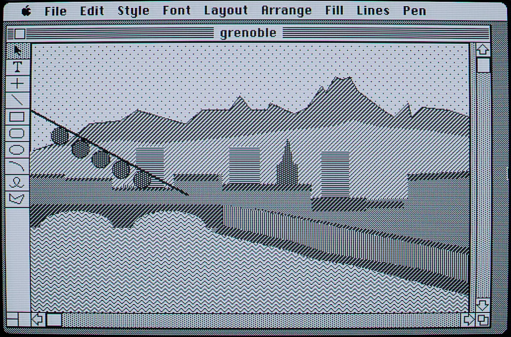
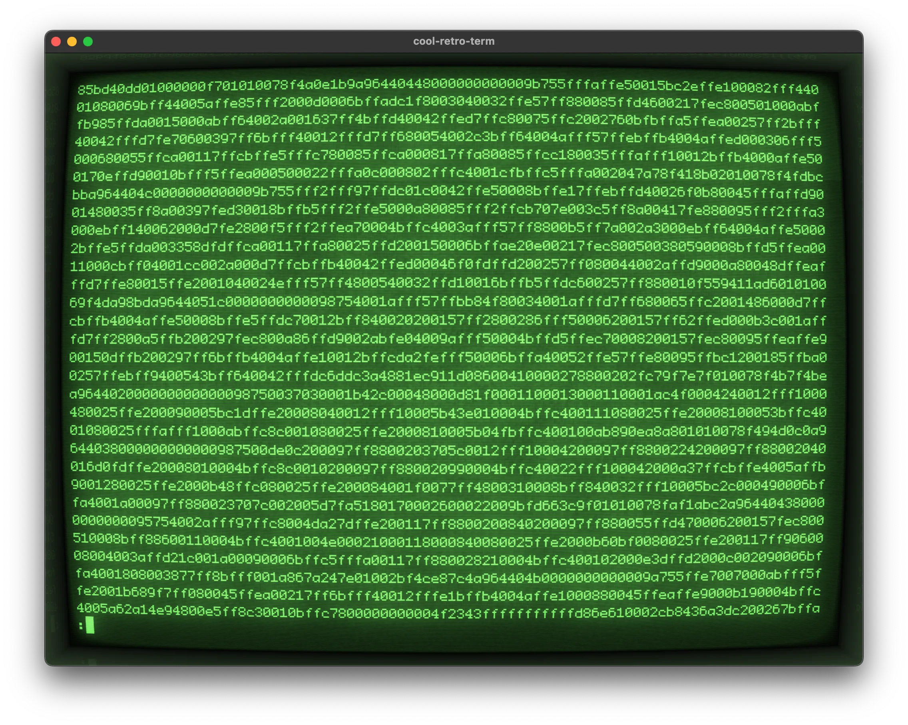
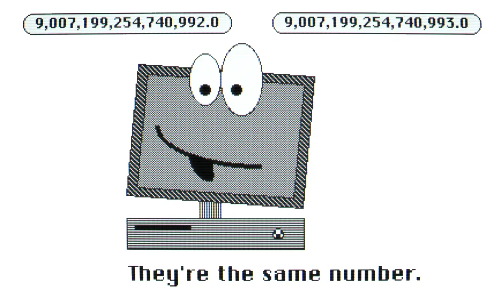
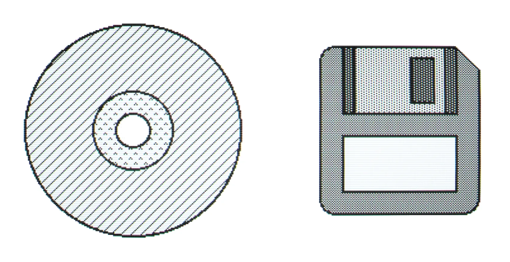
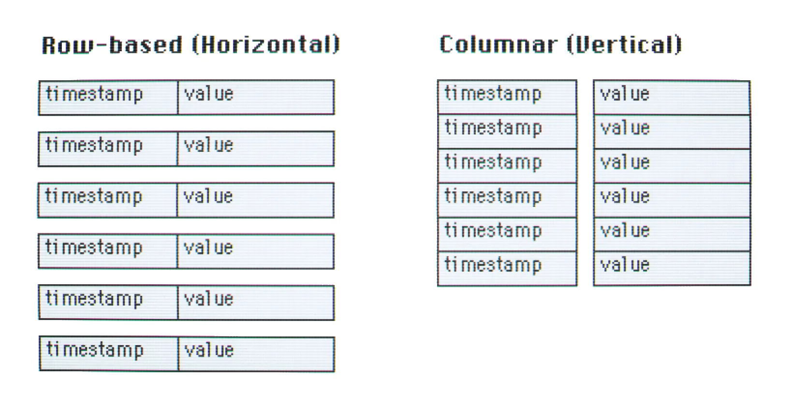
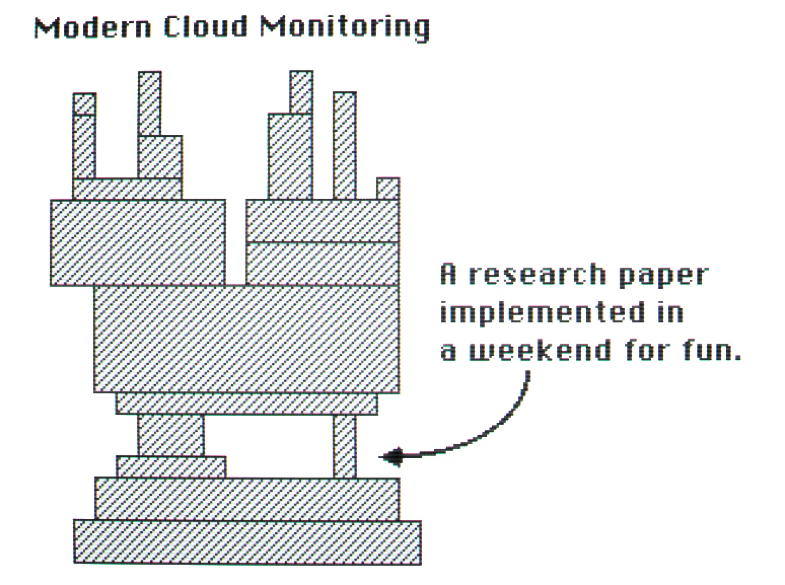

# Every Bit Counts, a Journey Into Prometheus' Binary Data

It was day five of what I thought would be a fun two-day side project, and I had identified a small bug. Was my code wrong, or the original code running on millions of computers for years wrong? I blamed my code, it's almost always my code. However, after too many hours of debugging, I eventually found the bug in the original code.

Sometimes, Prometheus was storing eight unnecessary zeros! That's not right! We often discuss sustainability and saving the world from the climate crisis at work. We guessed that fixing the bug could reduce the Prometheus' environmental footprint by a few grams of CO₂ per year, so I could allow myself a plastic straw.


*It's common practice to start an article with a random illustration. I made the illustrations using MacDraw instead of generative AI art, to better please the target audience.*

## Time-series Data and Prometheus

A time series is a collection of events or values recorded over time. For example, a thermometer recording a room temperature every five seconds produces time-series data.

[Prometheus](https://prometheus.io/) is a very popular open-source monitoring and alerting software that includes a time-series database, among many other features. You could use Prometheus to monitor the temperature of your rooms, and get an alert if it's too cold, too hot, or if a thermometer is broken. You can also use Prometheus with other software to make beautiful graphs and dashboards. Office workers love graphs and dashboards.

I'm building [SensApp, a time-series data platform](https://github.com/SINTEF/sensapp) to support researchers and engineers. It's not rocket science, but we need a tool that can handle many time series and perform well with historical data. Most time-series platforms do not enjoy or even support complex queries over extended periods. Such as "monthly average of room temperatures grouped by the building construction materials and building age, in Oslo, over the last 10 years".

I already made [SensApp compatible with InfluxDB](https://github.com/SINTEF/sensapp/blob/main/docs/INFLUX_DB.md), a Prometheus competitor, and it's now time to integrate it with Prometheus. I want the users to be able to use their familiar tool, and I don't want to re-implement many Prometheus features if I don't have to.

Prometheus has a [remote read API](https://prometheus.io/docs/prometheus/latest/querying/remote_read_api/) that is perfect for what I need. However, while Prometheus is great, it is written in Go*lang*, and I love another programming language more these days. Be reassured, I'm not trying to preach about <span title="It is Rust.">the other programming language</span>, Go*lang* is fine. However, I need to re-implement some of Prometheus' data formats in my loved programming language.

## How I Found the Bug

This article will discuss `0` and `1` in computers. It's going to be a bit technical, but I hope it's still be understandable by most.

### The Prometheus Remote Read API Supports an Easy Format

The Prometheus Remote Read API supports two data formats, an easy and a hard one. I implemented them both, the easy one to have a minimum viable product, and the hard one to feel more accomplished. It's also supposedly more efficient because it's Prometheus' native format.

The easy format in Prometheus remote read API is pretty straightforward: get the [Protocol Buffers](https://developers.google.com/protocol-buffers) [definitions](https://github.com/prometheus/prometheus/blob/c328d5fc8820ec7fe45296cfd4de8036b58f4a3a/prompb/types.proto), quickly and easily implement a serialiser, compress the serialised data with [Snappy](https://github.com/google/snappy), and voila.

### Gorilla's XOR Chunks is a Challenging Format

The other format is a stream of XOR chunks adapted from the Gorilla time-series database. A chunk is a block of data of about 120 samples.

Gorilla is a database developed by Facebook/Meta that you could read about in the [Gorilla: A Fast, Scalable, In-Memory Time Series Database](https://www.vldb.org/pvldb/vol8/p1816-teller.pdf) paper published in 2015.

Prometheus adopted the Gorilla's XOR chunks, with a few adjustments. Timestamps are measured in milliseconds instead of seconds, for example. In short, XOR chunks exploit that time series are often stable over time and store the data more efficiently for computers. XOR refers to one of the tricks used to store the data efficiently.


The format is pretty much unreadable for humans. No one had spotted the unnecessary zeros hiding in plain sight.

XOR chunks are a bit complicated, to be honest. It's not extreme, but it is the most complex data format I have dealt with so far. However, it's relatively well documented [in Prometheus](https://github.com/prometheus/prometheus/blob/main/tsdb/docs/format/chunks.md), the [research paper](https://www.vldb.org/pvldb/vol8/p1816-teller.pdf), and you can always read the [Prometheus source code](https://github.com/prometheus/prometheus). I read the source code so many times…

### Variable Length Encodings Save Bits

Usually, people decide in advance how many bits they need to represent their numbers in computers. For example, 8 bits is enough to represent a number between 0 and 255 or -128 and 127. If the software encounters bigger numbers, you go with more bits. The industry uses 64 bits by default for now, representing whole numbers between -9,223,372,036,854,775,808 and 9,223,372,036,854,775,807, or 18 quintillion different numbers. It's often more than enough. Not always.

Prometheus uses 64 bits numbers internally, but instead of always using 64 bits to store the data, Prometheus also uses variable length encodings. The number of stored bits will depend on the value. Big numbers will use more bits than small numbers. In practice, Prometheus' numbers use much fewer than 64 bits. But it sometimes uses more than 64 bits for the big numbers.

Prometheus uses a neat collection of variable encoding formats. Namely `varint`, `uvarint`, `varbit`, `varbit_ts`, and `varbit_xor`. And I had fun implementing them all, no sarcasm.

As an example, here is **42** encoded with the various number encoding formats found in Prometheus:

|Encoding|Size|Bits|
|-|-|-|
|16-bits Integer|16|`00000000 00101010`|
|64-bits Integer|64|`00000000 00000000 00000000 00000000 00000000 00000000 00000000 00101010`|
|64-bits IEEE 754 Float|64|`01000000 01000101 00000000 00000000 00000000 00000000 00000000 00000000`|
|uvarint|8|`00101010`|
|varint|8|`01010100`|
|varbit|13|`1110 0 00101010`|
|varbit_ts|16|`10 000000 00101010`|
|varbit_xor (when the previous value is 0)|28|`1 1 00001 001111 1000000 01000101`|
|varbit_xor (when the previous value is 42)|1|`0`|
|varbit_xor (when the previous value is 40 and the one before is 42)|1|`1 0 1`|

### By the Way, IEEE 754 Floating Point Numbers Are Weird

Computers deal with not only whole numbers but also decimal numbers. Representing decimal numbers with 0 and 1 bits is possible. It used to be a mess as people did represent those numbers differently, but eventually, people and computers adopted the [IEEE 754](https://en.wikipedia.org/wiki/IEEE_754). The wide adoption is a good success story. If you like reading about computer standards, you can [purchase the standard for *only* $106.00](https://standards.ieee.org/ieee/754/6210/). It is not the focus of this article, but it's important to know something: IEEE 754 decimal numbers are **weird**.

The approximate maximum value of a 64 bits IEEE 754 number is `1.7976931348623157e308`. It's a huge number, much bigger than `9,223,372,036,854,775,807`, the maximum value of a whole number using the same amount of bits.

The trick is to not care much about correctness. For example, most computers say that [9,007,199,254,740,99**2**.0 equals 9,007,199,254,740,99**3**.0](https://developer.mozilla.org/en-US/docs/Web/JavaScript/Reference/Global_Objects/Number/MAX_SAFE_INTEGER) and it is mostly fine. It's within the specifications of the IEEE 754 standard.

Software developers know [floating point numbers shenanigans](https://stackoverflow.com/questions/21895756/why-are-floating-point-numbers-inaccurate), but scientists working with time-series datasets are not always aware of the limitations. I don't have a crystal ball, but I guess that in many years, people will read in computer science history books about those 64 bits IEEE 754 numbers, and they will be horrified.

<span title="I like MacDraw."></span>

For now, every time-serie value in Prometheus is a 64 bits IEEE 754 floating point number. Sorry, if you want accurate numbers, Prometheus isn't for you.

### Computers Are Not Designed to Work Bit by Bit

Most computers are not good for working bit by bit. They are designed to work on group of bits called bytes. If you want the computer to load the n-th bit of your data, it's not trivial because computers cannot address bits directly, only bytes. A definition of byte is the computer's smallest addressable unit of memory.

Computers with bytes of size 1 exist and are great to work bit by bit. But they are very rare. Most computers have bytes of 8 bits, also named octets. 8 is a good number because it's a power of 2 (it's 2 x 2 x 2), which is convenient when working with binary numbers. Humans should perhaps evolve to have 8 fingers instead of 10.

Assuming a computer with octal bytes, if you want to load the 1234th bit of your data, you would have to divide 1234 by 8, which is 154 with a remainder of 2. Then you load the 154th byte of your data and get the 2nd bit of that byte. It's done with bitwise operations.

Loading the 1234th bit:

|154th byte: |0|1|2|3|4|5|6|7|
|-|-|-|-|-|-|-|-|-|
||b|b|b|b|b|b|b|b|
|||||||⬆|||

In Python, using the rarely used bitwise operators:

```python
(data[1234 // 8] >> (1234 % 8)) & 1
```

If we go closer to the machine instructions executed by the computer, while still not looking at [microcode](https://en.wikipedia.org/wiki/Microcode), it can look like the following RISC-V Assembly. I don't think many readers are fluent in RISC-V assembly, but we can observe that it doesn't look trivial. This code snippet is AI-generated. Please pardon me.

```asm
    li    x11, 1234        # Put 1234 in x11
    srai  x12, x11, 3      # Divide by 8 to get the byte offset (1234 / 8), store in x12
    lb    x13, 0(x12)      # Load the byte at the calculated address (byte offset)
    andi  x14, x11, 7      # Get the bit position within the byte (1234 % 8), store in x14
    li    x15, 1           # Load the bitmask base (1)
    sll   x15, x15, x14    # Shift the bitmask left by the bit position to isolate the bit
    and   x16, x13, x15    # Isolate the specific bit in the byte
    srl   x16, x16, x14    # Shift the isolated bit to the least significant position
```

### Prometheus Keeps Things Aligned to 8 Bits

Because it's much faster and simpler to work with bytes whenever possible, Prometheus aligns its data to 8 bits.

If necessary, it adds padding zeros at the end of its data blocks to have block sizes of a multiple of 8. The number of padding bits is from 0 to 7.

Examples of padding `0` bits at the end of the last octet:

|0|1|2|3|4|5|6|7|
|-|-|-|-|-|-|-|-|
|b|b|b|b|b|`0`|`0`|`0`|
|b|b|`0`|`0`|`0`|`0`|`0`|`0`|
|b|b|b|b|b|b|b|b|
|b|b|b|b|b|b|b|`0`|

## The Bug

Once in a while, the padding bit size of a Prometheus XOR chunk was 8 bits. Even though the data chunk was already aligned to 8 bits, Prometheus added an extra byte of 8 zero bits at the end of the data block.

|0|1|2|3|4|5|6|7|.|0|1|2|3|4|5|6|7|
|-|-|-|-|-|-|-|-|-|-|-|-|-|-|-|-|-|
|b|b|b|b|b|b|b|b|.|`0`|`0`|`0`|`0`|`0`|`0`|`0`|`0`|

I discovered it because I had an assertion in my parsing code to ensure the padding size was between 0 and 7 bits long. Prometheus' parser ignores the padding and doesn't check its size, so no one noticed the bug until now. The bug wasn't always happening, but it wasn't rare either.

To work bit by bit on computers with octal bytes, Prometheus contains a package named `bstream`, imported from [go-tsz](https://github.com/dgryski/go-tsz). This package contains methods named `writeBit`, `writeBits`, and `writeByte`.

Padding bits are a side effect of how the `bstream` package manages its bits. There is no explicit management of the padding bits in the Prometheus codebase. The bits are stored in a list of octal bytes. Thanks to this design, it's always aligned to 8 bits, and the last unused bits are always zero.

After debugging the Prometheus codebase with a classic mix of breakpoints and print statements, I found the bug: the `writeByte` method, which is called by the `writeBits` method, was allocating two bytes instead of one when the previous byte was full. The second byte was often used soon after, but if this happens towards the end of the data block, the second byte is left unused and becomes unnecessary padding.

```go
func (b *bstream) writeByte(byt byte) {
  // Allocates a byte if there is no space left.
  if b.count == 0 {
    b.stream = append(b.stream, 0) // <- First allocation
    b.count = 8
  }

  i := len(b.stream) - 1
  // Complete the last byte with the leftmost b.count bits from byt.
  b.stream[i] |= byt >> (8 - b.count)
  b.stream = append(b.stream, 0) // <- Second allocation
  i++
  // Write the remainder, if any.
  b.stream[i] = byt << b.count
}
```

## Fixing the Bug

[I proposed the following fix](https://github.com/prometheus/prometheus/pull/14854):

```diff go
func (b *bstream) writeByte(byt byte) {
 if b.count == 0 {
-  b.stream = append(b.stream, 0)
-  b.count = 8
+  b.stream = append(b.stream, byt)
+  return
 }

 i := len(b.stream) - 1
```

I wasn't sure it would be merged by the maintainers, as this was critical and historical code, but it did! I want to thank them for their quick review and merge.

A next release of Prometheus, perhaps version 3.0.0, will not have unnecessary padding bits in its data.

### Grams of CO2 May Be Saved

It's challenging to precisely estimate the impact of such a fix. I haven't done the extensive real-world survey needed to have precise numbers. We have to guess with a [back of the envelope calculation](https://en.wikipedia.org/wiki/Back-of-the-envelope_calculation).


*I roughly estimate that the fix saved some big cloud providers the equivalent storage size of one Blue-Ray disc, and most companies the equivalent storage size of one Floppy disc.*

The bug occurs when both the bit size of the last encoded value to be stored and the number of already stored bits are multiples of 8.

If we have a uniform distribution, it's 1/8 * 1/8 = 1/64 of the time. We can say it's a byte saved in about 1% of the Prometheus data chunks. It matches my observations.

Prometheus has many data chunks, as a chunk usually contains [only 120 samples](https://github.com/prometheus/prometheus/blob/faf5ba29bade4d2483b491013363fddfbc301def/storage/series.go#L285). How many chunks are stored per Prometheus instance on average, and how many Prometheus instances are running worldwide? I don't know.

We can start with Prometheus' defaults: 15 days of data with a 15-second interval. The number of time-series per Prometheus instance is more challenging to estimate, and the number can quickly go up to millions thanks to the [high cardinality problem](https://www.timescale.com/blog/what-is-high-cardinality-how-do-time-series-databases-influxdb-timescaledb-compare/). We will be conservative and say 1000 time-series per instance on average. That's about 10 saved kilobytes per instance!

The [2023 Survey of the Cloud Native Computing Foundation (CNCF)](https://www.cncf.io/reports/cncf-annual-survey-2023/) found that 77% of the respondents use Prometheus. The survey is likely not very representative of the average cloud user, but we could estimate that millions of Prometheus instances are running worldwide among the many millions of cloud customers. If we say 10 million instances, that's in the magnitude of 100GB of saved storage space worldwide.

[A Standford magazine article](https://stanfordmag.org/contents/carbon-and-the-cloud) estimates the environmental footprint of 100GB stored in the cloud at about 200kg of CO₂ per year.

That's also a conservative number. We know that [CloudFlare has about 5 billion time series](https://blog.cloudflare.com/how-cloudflare-runs-prometheus-at-scale/), and the fix may save them about 50 gigabytes. They are likely not alone to use Prometheus at large scale.

It's also a wild guess with many assumptions and uncertainties. We didn't consider that many chunks are read at frequent intervals, potentially over the network. Estimating CO₂ emissions of software in the cloud [is a complex topic](https://www.cloudcarbonfootprint.org/docs/methodology).

It looks like it's more impactful than what I expected before doing the calculation. I was expecting a few grams of CO₂ at best, but removing one byte many times has some impact even though it's not much.

### The Jevons Paradox

When discussing optimising software, I must mention the [Jevons Paradox](https://en.wikipedia.org/wiki/Jevons_paradox). The paradox suggests that when a technology reduces its resource consumption, the consumption of the resource may increase instead of decrease. This is counter-intuitive, but the increased efficiency may make the technology cheaper or more accessible, which can lead to more usage.

We will not observe behaviour changes for a few kilobytes per Prometheus instance. But imagine that Prometheus somehow makes its data format 10 times more efficient. People would likely store even more data with Prometheus instead of reducing their cloud use.

## A Deep Dive for the Interested Readers

This section is more technical and for curious readers who are into bits. Feel free to scroll down to the conclusion.

### The Right Endianness, and the Endianness I Dislike

The [Datapoint 2200](https://en.wikipedia.org/wiki/Datapoint_2200) computer was released in 1970 and it represented numbers in a way I dislike. Bits are split into groups of bits, named bytes, and the order of the groups is reversed, but not the order of the bits inside the groups.

As a decimal example, let's take the number 1234,5678 and groups/bytes of size 4. With the Datapoint 2200 way, this number would be written as 5678,1234. This is called little [endianness](https://en.wikipedia.org/wiki/Endianness). It is more convenient for [some very old computers](https://en.wikipedia.org/wiki/Serial_computer), but it is challenging for humans to read.

Still in the early 70s, Intel developed the [Intel 8008](https://en.wikipedia.org/wiki/Intel_8008) with a [Datapoint comptability](https://en.wikipedia.org/wiki/Datapoint#Datapoint_2200_and_the_Intel_8008). The industry somehow got stuck with this. This is still the most common way computers represent numbers today.

Prometheus didn't pick a side. While it stores most of its numbers using the *right way*, also called big-endianness, it uses little-endianness for a few numbers.

### uvarint is Good Enough

`varint` and `uvarint` are number encoding formats not specific to Prometheus. They are coming from the Golang standard `binary/encoding` package. Some [non-Golang specific documentation](https://github.com/multiformats/unsigned-varint) can be found.

A `uvarint` takes a zero or positive number and represents it in binary using 1 to 10 whole octets. In each octet, a byte consisting of 8 bits, the first bit says whether another octet follows. If the first bit is 1, another octet follows. If the first bit is 0, it's the last octet.

It makes me sad that `uvarint` uses a little-endian representation.

Examples of values:

|Decimal|Uvarint Binary|
|-|-|
|0|`00000000`|
|1|`00000001`|
|127|`01111111`|
|128|`10000000 00000001`|
|255|`11111111 00000001`|
|300|`10101100 00000010`|
|16384|`10000000 10000000 00000001`|

It is not the most compact encoding for big and small numbers, but it's suitable for medium-sized numbers. Prometheus uses this encoding format for likely medium-sized numbers, such as the data size or the number of samples.

### varint, and its Zigzag Encoding

Numbers that can be negative are a bit tricky. Most computers use a two's complement representation to store negative numbers. Without going into details, your computer likely represents the number -1 like this in binary: `1111 1111 1111 1111 1111 1111 1111 1111 1111 1111 1111 1111 1111 1111 1111 1111`. This is not good. There are way too many significant bits for such a small number.

The `varint` encoding uses a trick called [zigzag encoding](https://en.wikipedia.org/wiki/Variable-length_quantity#Zigzag_encoding). It multiplies the numbers by two. Positive numbers are even, and negative numbers are made positive using their absolute value and substracted one to become odd. Finally, it uses the `uvarint` encoding to store the numbers, which are now all positive. Going the other way around is similar. It divides the number by two. If the remainder of the division is 1, the number is made negative by multiplying it by -1.

Small negative numbers can also be stored more compactly, thanks to the zigzag encoding.

Example of values:

|Decimal|Varint Binary|
|-|-|
|0|`00000000`|
|-1|`00000001`|
|1|`00000010`|
|-2|`00000011`|
|2|`00000100`|
|-128|`11111111 00000001`|
|128|`10000000 00000010`|

Prometheus uses this encoding format for numbers with a likely not-so-small negative value.

### Saving the Difference of the Difference

Instead of storing every timestamp of a time series, Prometheus stores differences and differences of differences.

* The first timestamp is stored using the `varint` encoding. A timestamp can be a negative number.
* The second timestamp is stored as the difference between the first and the second timestamp, using the `uvarint` encoding. The difference is always a positive number. The time series is sorted by time from the oldest to the newest.
* The remaining timestamps are stored as the difference the previous timestamp difference and the new difference, using the `varbit_ts` encoding.

For example:

|Timestamp|Difference|Difference of the difference|Stored|Stored binary|
|-|-|-|-|-|
|100|||100|`10000001 01001000`|
|102|2||2|`00000010`|
|104|2|0|0|`0`|
|106|2|0|0|`0`|
|107|1|-1|-1|`10111111 11111111`|
|108|1|0|0|`0`|

### varbit_ts Encoding

The `varbit_ts` encoding is a hybrid. It's a variable encoding format that uses fixed length encoding internally. The main logic is to organise numbers in 5 buckets with corresponding fixed-length encoding. Small numbers can be represented using fewer bits. The bucket identifier is serialised as zero to three `1` followed by a `0` or four `1`.

|Bucket|Prefix|Fixed length encoding size|Total number of bits|
|-|-|-|-|
|0|`0`|0|1|
|-8191 to 8192|`10`|14|16|
|-65535 to 65536|`110`|17|20|
|-524287 to 524288|`1110`|20|24|
|everything else|`1111`|64|68|

Unlike `uvarint` or `varint`, it's not restricted to byte boundaries: the number of serialised bits doesn't have to be a multiple of 8.

The `varbit_ts` encoding doesn't use any fancy trick to represent negative numbers, it's the classic two's complement representation. It uses the right way to represent binary numbers: big-endian.

The bucket size have been optimised to represent timestamp differences in milliseconds. But you may have noticed, -1 is represented as `10111111 11111111`. It is a bit much for such a small number. The Prometheus source code has a comment stating, "This seems to needlessly jump to large bit sizes even for very small deviations from zero. Timestamp compression can probably benefit from some smaller bit buckets." I think the comment is correct.

### varbit, the Better varbit_ts Encoding

The [`varbit` encoding](https://prometheus.io/blog/2016/05/08/when-to-use-varbit-chunks/#what-is-varbit-encoding) is an improvement over the `varbit_ts` encoding. It uses the same bucket concept but with more and smaller buckets. It is not used everywhere yet, as it would introduce a major change in Prometheus' data format.

|Bucket|Prefix|Fixed length encoding size|Total number of bits|
|-|-|-|-|
|0|`0`|0|1|
|-3 to 4|`10`|3|5|
|-31 to 32|`110`|6|9|
|-255 to 256|`1110`|9|13|
|-2047 to 2048|`11110`|12|17|
|-131071 to 131072|`111110`|18|21|
|-16777215 to 16777216|`1111110`|25|33|
|-36028797018963967 to 36028797018963968|`11111110`|56|64|
|everything else|`11111111`|64|72|

An improvement can be made, though. A bucket can represent numbers that could have fitted in a smaller bucket. For example, nothing prevents storing the value 1 using 72 bits instead of 5. A comment in Prometheus' source code states that around 1% space could be saved by making a more complex format that substracts the minimum value of the bucket before encoding the number. This is deemed too complex for now.

After fully implementing the varbit format, I realised I didn't need it for my project. It's only used within Prometheus histograms, which I don't plan to use. But at least you can see that Prometheus still has some optimisations on the table.

### The XOR Trick

Prometheus doesn't store whole sample values but only the value differences between successive samples. It's done at the bit level using an XOR operation on the binary IEEE 754 representation of the floating point numbers. Using a big-endian representation, thankfully.

If you are a bit rusty with the XOR truth table, here it is:

| A | B | A XOR B |
|---|---|---------|
| 0 | 0 | 0       |
| 0 | 1 | 1       |
| 1 | 0 | 1       |
| 1 | 1 | 0       |

When XORing two values, identical bits are `0`, and different bits are `1`. What is nice about the XOR operator is that it's reversible. You get the other value if you XOR the result with one of the original values. Prometheus stores the XOR differences and builds back the original values using the reversibility of the XOR operation.

You only need to store the first value and the differences.

* value_0 XOR value_1 = difference_1
* value_1 XOR value_2 = difference_2
* ...
* value_n-1 XOR value_n = difference_n

To deserialise the data, you can rebuild the original values using the differences.

* value_0 XOR difference_1 = value_1
* value_1 XOR difference_2 = value_2
* ...
* value_n-1 XOR difference_n = value_n

The trick is then to skip the leading and trailing zeros. A XOR difference can have plenty of zeros, so skipping zeros is very effective.

For example, the numbers `123.0` and `126.0` are represented in binary as:
`01000000 01011110 11000000 00000000 00000000 00000000 00000000 00000000` and
`01000000 01011111 10000000 00000000 00000000 00000000 00000000 00000000`. The XOR difference is `00000000 00000001 01000000 00000000 00000000 00000000 00000000 00000000`. The difference has 15 leading zeros and only 3 significant bits. Prometheus skips those and will store the difference as `1 1 01111 000011 101`.

When the number of leading zeros and significant bits is the same as the previous XOR difference, Prometheus will also skip the number of leading zeros and significant bits and tell to reuse the numbers of the prior sample. The `123.0` and `126.0` example would be serialised as `1 0 101` if the previous XOR difference also has 15 leading zeros and 3 significant bits.

If the value hasn't changed, it is serialised as only one `0`.

varbit xor numbers have three modes:

* `0`: No differences.
* `1 0 [1-64 bits]`: Difference, reuse the previous number of leading zeros and significant bits.
* `1 1 [5 bits - leading zeros count] [6 bits - significant bits count] [1-64 bits]`: Difference, different number of leading zeros and significant bits.

The number of leading zeros is encoded on 5 bits, allowing between 0 and 31 leading zeros. If a number has more than 31 leading zeros, a maximum of 31 leading zeros will be skipped.

The number of significant bits is encoded on 6 bits, allowing between 0 and 63 significant bits. However, Prometheus works with 64 bits numbers. One solution would have been to use 7 bits to encode 64, too, but instead, a trick was used: 64 significant bits are serialised as 0. It is confusing but fine because an XOR difference with 0 significant bits would be serialised as "no differences" so the 0 value is reused. Here, nothing is wasted.

### Prometheus Disk Format

Prometheus starts its files with `0x85BD40DD`. It's a number used to identify the format of the file. People call it a magic number, but I'm not sure it's magical.

A single-byte integer follows to specify the file version. Currently, only version 1 exists. It also has 3 bytes of zeros for padding and perhaps for future use.

Example for Version 1:

|Byte:|0|1|2|3|4|5|6|7|...|
|-|-|-|-|-|-|-|-|-|-|
||`0x85`|`0xBD`|`0x40`|`0xDD`|`0x01`|`0x00`|`0x00`|`0x00`|...|

The chunks are then stored sequentially in the file. Prometheus does [have indexes](https://github.com/prometheus/prometheus/blob/main/tsdb/docs/format/index.md) to know where the chunks are stored in the file, but it's stored in another `index` file.

I implemented a parser for those indexes. It's also fun, but the article is already long enough.

### Prometheus Chunks

A chunk starts with a header that consists of the chunk size in bytes, and the chunk type. It ends with a footer containing a 4 bytes CRC32 checksum.

|1-10 bytes|1 byte|...|4 bytes|
|-|-|-|-|
|Chunk Size|Chunk Type|Data|CRC32|

The chunk size is encoded as a `uvarint`.

The chunk type is a single-byte enumeration serialised like this:

|Type|Value|Binary Value|
|-|-|-|
|XOR|1|`00000001`|
|Histogram|2|`00000010`|
|Float Histogram|3|`00000011`|

A whole byte is likely wasted on this enumeration to keep the data section of the chunk aligned to a byte boundary. As we saw before, working on data aligned to bytes is much easier.

We only looked at the XOR chunks in this article. The histogram chunks are an "exercise left to the reader".

The [Cyclic Redundancy Check](https://en.wikipedia.org/wiki/Cyclic_redundancy_check) is used to ensure the data integrity. It uses the Castagnoli polynomial, a more modern polynomial than the classic CRC32 polynomial. The CRC32 checksum is stored in big-endian, as it should be.

Having checksums in a data format is a good idea. Unless you know what Btrfs or ZFS are and use them, your operating system likely doesn't detect nor prevent the corruption of your stored data. It's another thing that will look wild for us in the future.

### Prometheus XOR Chunk

A Prometheus XOR chunk consists of:

|Section|Format|Size|
|-------|------|----|
|Number of Samples|Big Endian 16 bits Integer|16 bits|
|First Sample TimeStamp|`varint`|8 to 80 bits, but usually 48 bits|
|First Sample Value|IEEE 754 64 bits Float|64 bits|
|Second Sample TimeStamp Difference|`uvarint`|1 to 10 bits|
|Second Sample XOR Difference|`varbit_xor`|1 to 72 bits|
|Third Sample TimeStamp Difference of Difference|`varbit_ts`|1 to 68 bits|
|Third Sample XOR Difference|`varbit_xor`|1 to 72 bits|
|...|
|Nth Sample TimeStamp Difference of Difference|`varbit_ts`|1 to 68 bits|
|Nth Sample XOR Difference|`varbit_xor`|1 to 72 bits|
|Padding|zeros|0 to 7 bits|

Only the first sample and the number of samples are required.

The format could be further optimised, though it's already excellent. Some thoughts:

* Switching some number encoding formats. For example, using the better `varbit` instead of `varbit_ts` and using `uvarint` instead of 16 bits integers.
* Compressing the data using a fast compression algorithm, with a pre-shared dictionary. If it's worth the CPU time.
* The format could be columnar instead of row-based. It may perform better when compressed. Perhaps not.


One of my hobbies is talking about columnar data storage's benefits to people who don't care.

## rusty-chunkenc, the Rust Crate you Will Probably Never Use

In case some Rust enthusiasts want to parse or serialise Prometheus' binary data, I made a Rust crate named [rusty-chunkenc](https://docs.rs/rusty-chunkenc/latest/rusty_chunkenc/). It's an alternative to the Go*lang* [chunkenc](https://pkg.go.dev/github.com/prometheus/prometheus/tsdb/chunkenc) package.

The parser was developed using [nom](https://github.com/rust-bakery/nom), a parser combinator library for Rust. It's very good and has made Rust my favourite language for parsing challenging data.

You can decompose the parsing into small functions, and nom lets you combine them in a somewhat readable way. It's still Rust, so the function signatures can be verbose.

```rust
pub fn read_varbit_xor<'a>(
    previous_value: f64,
    previous_leading_bits_count: u8,
    previous_trailing_bits_count: u8,
) -> impl Fn((&'a [u8], usize)) -> IResult<(&'a [u8], usize), (f64, u8, u8)> {
    move |input: (&'a [u8], usize)| {
        let (remaining_input, value) = bool(input)?;
        ...
    }
}
```

Isn't that beautiful?

I hope the crate is easy to use:

```rust
let chunk = rusty_chunkenc::Chunk::new_xor(vec![
    rusty_chunkenc::XORSample {
        timestamp: 7200000,
        value: 12000.0,
    },
    rusty_chunkenc::XORSample {
        timestamp: 7201000,
        value: 12001.0,
    },
]);

// Serialise the chunk
let mut buffer: Vec<u8> = Vec::new();
chunk.write(&mut buffer).unwrap();

// Parse a chunk from a buffer
let (_, parsed_chunk) = rusty_chunkenc::read_chunk(&buffer).unwrap();
println!("parsed_chunk: {:?}", parsed_chunk);
```

## Conclusion

This article deeply explored the Prometheus XOR Chunk binary data formats. We also looked at the small bug I found and the fix that will be released soon. We estimated the impact of the fix on the environment, and we saw that it's not nothing. It's also far from solving the climate crisis.

### Do we Need to Care About Bits?

Software engineers often say "storage is cheap" as an excuse to not care about storage optimisations. Thanks to the cloud, storage is virtually infinite. The limit is your financial wealth in practice. Everyone can now easily store too much time-series data. Optimising storage significantly impacts performance, bills, and the environment in this context.

[SensApp](https://github.com/SINTEF/sensapp) used to not care about storage optimisations. It was 2012, Daft Punk <span title="Random Access Memories">was working on a new album</span>, storage was cheap, the MongoDB database was hyped, we thought that [JSON time-series](https://www.rfc-editor.org/rfc/rfc8428) was a suitable storage format. So we stored JSON time-series in MongoDB. It did not scale. It was so slow. We abandoned the project for a decade.

Thanks to the experience of previous mistakes, I would advise you to care a bit about storage. One doesn't have to optimise to an extreme amount down to the bits level, but it has to be good enough. And there is probably something good enough between NoSQL document databases and super fancy optimised binary formats in bespoke databases.

As always, SQLite would probably work fine. Any columnar database would likely do great on large datasets. DuckDB, for example, has a cool name. The format Apache Arrow is a safe bet nowadays.

Overall, I think Prometheus is efficient, fast, and successful because it cares about bits, though it has many other qualities. We can see that the minor optimisations have an impact at scale.

### This Is Possible Because Prometheus Is OpenSource

This would never have happened if Prometheus was a closed-source software. The open-source community is doing a great job with Prometheus, and I'm happy to have contributed a tiny bit to it.


*[XKCD #2347](https://xkcd.com/2347/) adaptation, CC BY-NC 2.5.*

Damian Gryski wrote the original Golang XOR chunk implementation, and [he commented in the bug fix pull request](https://github.com/prometheus/prometheus/pull/14854#issuecomment-2341429038): "I implemented the original paper in a weekend for fun, more or less."

Before reading his comment, I had estimated about two days of work for my XOR chunk implementation. Maybe I'm not bad at estimations, after all. I'm just slow.

## Finally, Let me Talk About our Sponsors

This work is conducted within the [Smart Building Hub](https://smartbuildinghub.no/) research infrastructure project, which is funded by the [Norwegian Research Council](https://www.forskningsradet.no/). This is public Norwegian funding, and even if you are not paying taxes in Norway, you indirectly support this project thanks to our world's dependency on oil and gas. Thank you!

---

Antoine Pultier – 2024-09-24 – SBHub Project.
